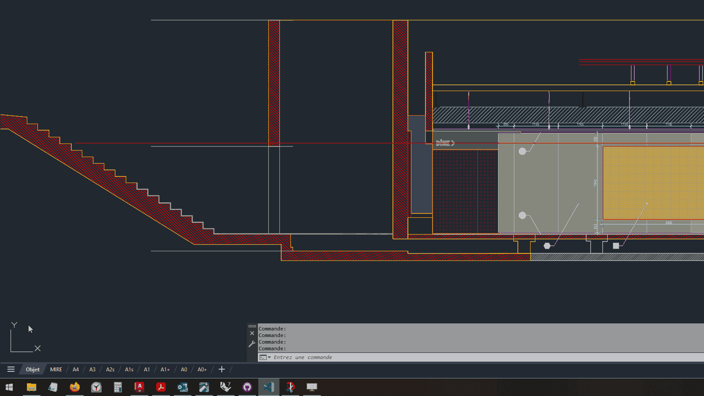
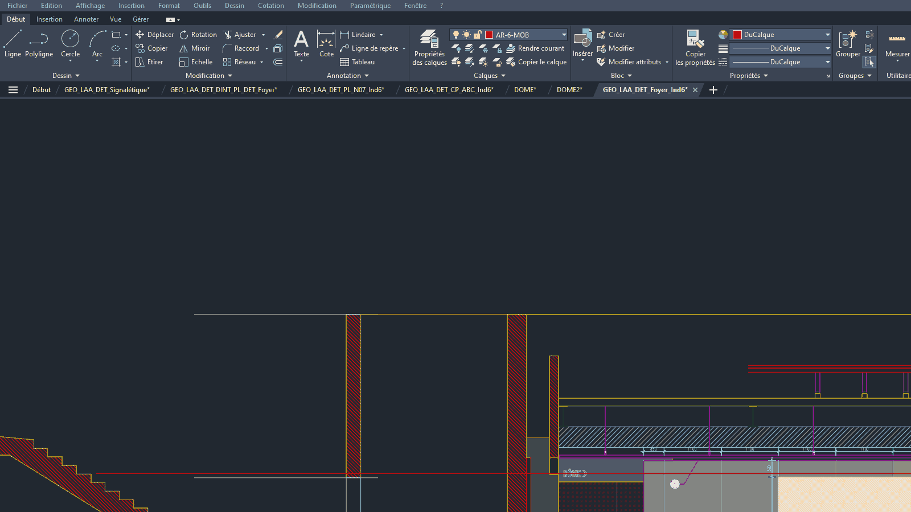

# Command Aliases (shortcuts for AutoCAD commands)

AutoCAD, as a software, is centered around commands and keyboard input. The existence of a graphical user interface makes it more approachable, but underneath, it's all commands.

While the menu is quite useful for commands that you use less often, if you find yourself reaching for the same ones over and over again, it's incomparably faster to use the keyboard to type in the command (or its _alias_, as we'll soon see.)

## Where to find them

The aliases used by AutoCAD are stored in a file named `acad.pgp`, which you can find in a couple of ways:

### By navigating to %APPDATA%

You can either manually navigate to the "User/AppData/Roaming" folder on your disk, or use the "Run" command on Windows to get there (`Win + R` → `%APPDATA%`).



### From the AutoCAD Ribbon



## Default aliases

By default, AutoCAD provides a long list of aliases that are usually intuitive and straightforward. Here are some of the most useful ones, as defined in the "acad.pgp" file:

```title="acad.pgp"
AR,        *ARRAY
-AR,       *-ARRAY
B,         *BLOCK
BE,        *BLOCKEDIT
BO,        *BOUNDARY
CP,        *COPY
F,         *FILLET
G,         *GROUP
H,         *HATCH
J,         *JOIN
L,         *LINE
-LA,       *-LAYER
M,         *MOVE
O,         *OFFSET
-P,        *-PAN
PE,        *PEDIT
PL,        *PLINE
PO,        *POINT
PU,        *PURGE
-PU,       *-PURGE
RE,        *REGEN
RO,        *ROTATE
S,         *STRETCH
SC,        *SCALE
TR,        *TRIM
XC,        *XCLIP
XL,        *XLINE
XR,        *XREF
Z,         *ZOOM
```

_These bindings will probably be different if you're using AutoCAD with a different language._

If you have the time, I strongly encourage you to read through the file, you might find a command or alias you don't know about!

## Adding custom bindings

While the AutoCAD defaults are a great place to start, it's still a good idea to add some of our own. To do this, you _could_ modify the text directly, but a better way (as suggested by AutoCAD) is to **append your own bindings to the end of the document.** 

This way, it's possible to easily revert to the original state (by deleting/disabling all the additional rows), and to share your own bindings with others.

Here are some useful ones that I recommend:

### Layer commands

```title="acadlt.pgp"
CL,         *LAYMCH
FL,         *LAYFRZ
LL,         *LAYLCK
UL,         *LAYULK
SL,         *LAYMCUR
IL,         *LAYISO
UNIL,       *LAYUNISO
```