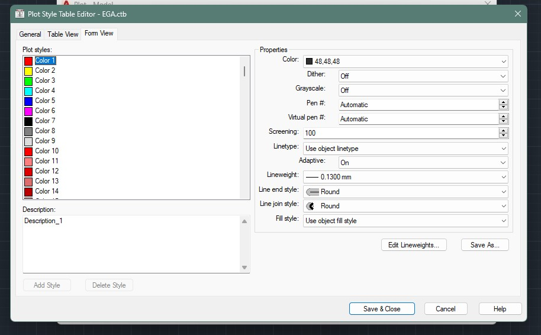

# CTB (Color-dependent Plot Style Table)

I don't know how they went from _"Color-dependent Plot Style Table"_ into _"CTB",_ but that's what it stands for. CTB's are called CTB's because the file format is `.ctb`.

As the name suggests, a CTB will take a colorful drawing and "translate" it into different colors, line thicknesses, and so on. In other words, it affects **plot styles** depending on the object's color.

<figure markdown="span">
  
  <figcaption>Example: a plot style replacing the color "1" (red).</figcaption>
</figure>

## Important things to consider

**A CTB file can only affect index colors** (1–255).  
Any object that use a true color will be completely ignored by your CTB. If you want colorful output, make sure you include at least some basic colors in your CTB. In my personal CTB, I have included blue, red, green, yellow— 2 shades each.

**CTBs and Layers go hand in hand.**  
In other words, your layer structure should reflect the CTB you're working with, so that the drawing looks good in autopilot. You shouldn't have to modify your basic layer colors or your CTB for each drawing; even if you have to add new layers, make sure they respect your CTB.

**Keep the end result simple.**  
Don't go overboard with tons of different linewidths and shades of gray, two or three of each are generally more than enough (most go with 1 black and 1 gray). In my case, I have one _almost-black_ (48,48,48), 2 shades of gray (dark & light), and the colors mentioned above. As for linewidths, 2 thick (.3 and .25) & 2 thin lines (.13 & .08) suffice. If you need more than that, consider making different CTBs (a "thick" and a "thin" one).

**Don't make a new CTB for each drawing scale.**  
To use a real-life analogy, your CTB is like your pencilcase. Sure, you might use some of your thicker pencils for bigger scale drawings, and some thinner ones for the smaller scales. But you don't go out of your way to _change your entire pencilcase_ for each drawing— you just pick out certain tools rather than others.

Your CTB should reflect that attitude. If you really want, have maybe a second one for different _kinds_ of drawings, but making one for each scale is pointless. Not to mention annoying, when it comes to managing them.

**Have few styles, but many colors printing them.**  
The colors of your layers are not only for your CTB, but also for you to be able to distinguish between certain parts of your drawing. It is very reasonable to have 3-4 different colors that print the same, but "stand for" different things, especially when dealing with different linetypes.

**Consider reserving the colors 1–10 for black lines.**  
The colors 1-10 are "primary" colors that are the most commonly used. While different conventions do exist, these are usually the go-to colors, and they often represent 90% of your drawings.

**Use the colors 250 to 255 for grayscale, in reverse order.**  
You may think it counterintuitive at first, but don't forget you're drawing on a dark background. Dark shades of gray are less prominent than lighter ones; therefore, you should map your darker shades to lighter plot styles. 

**The brighter the color, the thicker the line it should produce.**  
As mentioned in the point above, on a dark background, light colors are more prominent than dark ones. The brighter the color, the more it stands out. Translating this to plotting on white, it'd mean a thicker black line, or an actual color that pops.

**Don't go near the color 5.**  
I could write an entire manual just on this subject, but I'll cut it short since your time is precious. Pure blue on black has _criminally low contrast values,_ and is strongly advised against because of its awful legibility. I understand AutoCAD for keeping it in there as a primary color— what I don't understand is how people actually use it and don't see what's wrong with the whole situation. It's basically invisible. Just use the color 150 if you need blue in your drawings.

## Where to find your CTBs

(plot or pagesetup)

(stylesmanager)

(those above are also how you create CTBs.)

## Creating your CTB

(pagesetup → display plot styles) + (display lineweights) = testing

(use the form view)

(select multiple colors at once, e.g. 1-10 and set them to black at one go)

### Dithering or no dithering?

### Linetypes?

actually not sure  
(Me, I want to _see_ my linetypes while drawing.)

<!-- [My own CTB](..\assets\EGA.ctb) -->