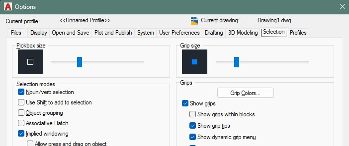
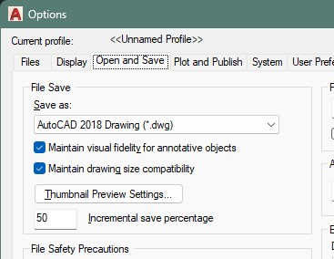

# AutoCAD Options

This is the easiest way to get some initial customization in: type in the "options" command, and an interface pops up with some settings to tweak.

Most (actually maybe all) of these functionalities are actually system variables, but more on that later.

## Pressing SHIFT to grab snap points

_(You can find this option under Drafting > Alignment Point Acquisition.)_

By default, AutoCAD's Object Snap lets you align with objects by hovering over them briefly, thereby "acquiring" the snap point.

However, this comes with some disadvantages:

1. You have to sit and wait to grab the point. For simple shapes this is not a problem, but it slows you down considerably if you have multiple points to align yourself with.  
2. The cursor may snap to undesired points, making it easy to trip and end up starting over.  
3. Cancelling a point is equally awkward, and often ends up with picking up even more unnecessary points.

While the above might seem trivial, here are some situations where this can get _really_ annoying:

- Dealing with heavy files, where a single undo takes seconds.  
- Sluggish computers, where the cursor lags behind and ends up places you didn't want it to go.  
- An overly sensitive or slow mouse, which reduces your accuracy.

_(Do notice that these situations can easily overlap.)_

Instead, this option to "cherrypick" your points by pressing `Shift` alleviates a lot of these issues. It makes it so that the operation is _as fast as you are._

The use is simple: hit `Shift` while hovering over a Snap Point to acquire it, and `Shift` again to remove it. Here's an example:

<figure markdown="span">
  
  <figcaption>Using "SHIFT" to pick points.</figcaption>
</figure>

## Don't make the cursor too big (or too small)

_(You can find this option under Selection > Pickbox Size.)_

Pretty straightforward: the cursor size needs to be just right. Too big, and you keep picking the wrong things. Too small, and you keep missing the right ones. For reference, this is how big I've set my own:

<figure markdown="span">
  
  <figcaption>My prefererred pickbox size.</figcaption>
</figure>

You might think that using a very small cursor is the "pro" way to go, but too small a cursor will end up being a hindrance instead, just like an overly sensitive mouse. The key to always pick the right objects is not through cursor size, but through healthy drawing habits. Here's some tips:

- Make sure the right objects are on top (this is _seriously_ painful),  
- If it's easier, pick multiple objects and remove the unwanted ones,  
- Make sure hatches aren't getting in your way (freeze them for precise work),  
- Manage your layers so that there aren't so many objects in the first place.

If you're interested in how to get better at picking exactly what you want, head over to the ["Selecting Objects"](../workflow/selection.md) article under the ["Workflow"](../workflow/index.md) section.

## Save to an older format

_(You can find this option under Open and Save > File Save.)_

For _reasons,_ a lot of people don't own the newest AutoCAD. Make sure your software saves your files in a reasonably compatible format. It's not only good for older versions of AutoCAD, but also for other software (e.g. Adobe Illustrator, Rhinoceros...) that can import `.dwg` files.

<figure markdown="span">
  
  <figcaption>I stick with 2018 unless asked otherwise.</figcaption>
</figure>

## Keep a dark theme

This should be obvious, but first of all, keep the display as intended: dark background, draw in bright colors. 

This is not only for your own sake, but for everyone else who will have to open your files in the future: if you make your background light, you have to make your drawing dark, and the vast majority who stick with the dark background will open your files only to curse you.

An important thing to consider is to **avoid using pure black for your background (#000000).** The extreme contrast with bright lights and completely spent blacks will have an adverse effect: the intense white will look as if bleeding into the black, and scrolling will tire out your eyes in no time. AutoCAD in particular is precise work, so lines are thin and bright, making it hard on the eyes.

I don't mess with the standard colors, but if you're set on doing so, here's two sensible recommendations:

- The background has a slight _blue_ tint to it, pulling it toward the red will help with pure blue lines (#0000ff in hexadecimal). Pure blue over black is _criminally bad_ for its contrast values, so avoid them as much as you can...  
- The default background for block editing is light gray. I don't know what AutoCAD was thinking, aside from "let's make it obvious that you're no longer in model space". That's fine I guess, but a more subtle color change would be better.