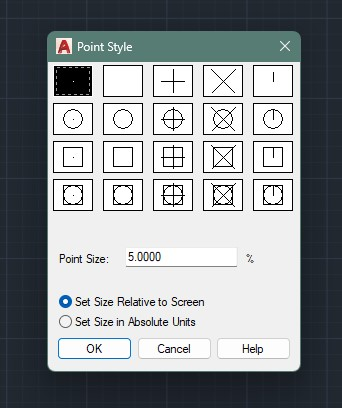
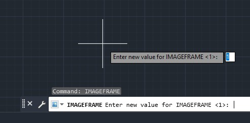
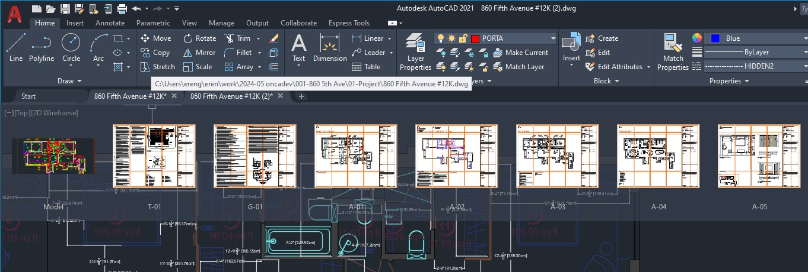
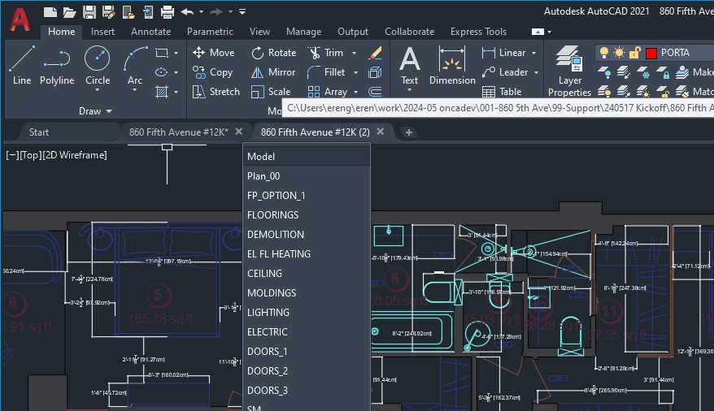

# System Variables

You may already know this, but we should still give this abstract term some definition. What are system variables?

The easiest way to visualize it _—that I can think of, anyway—_ is to imagine them as switches on a machine. These switches, known as _variables,_ change the way AutoCAD behaves. 

## Isn't it the same thing as "options"?

If you're wondering whether there's a difference between ["options"](options.md) and variables, the short answer is: _not really._ The "options" dialogue —the one that pops up when you invoke the `OPTIONS` command— is actually little more than a user-friendly interface to change some of the more common settings. Under the hood, it's _variables_ that it changes.

However, the settings you can access in the Options dialogue are quite limited. You won't find everything you need there: they are mostly _global_ settings that apply to how your software behaves, and **it doesn't include settings that are specific to the drawing itself.** You use variables to change many other things, for example:  

- The scale and behavior of dashed lines (specific to the drawing),  
- The way previews of your commands are displayed,  
- Whether or not certain objects will display/print their frames (images, xrefs...),  

...and so on. You can find an exhaustive list [here,](https://forums.autodesk.com/autodesk/attachments/autodesk/706/141573/1/AutoCAD%20System%20Variables.pdf) but there's no point to learing beyond the actually useful %1 out of all those.

## How to access them

It's easy! So easy, actually, that if you know the name of your variable, it's so much more convenient than opening the "options" dialog and searching for the setting you want to change.

For most of the variables that we need to concern ourselves with, there are specific commands that provide a convenient way. Commands like `PTYPE` and `OPTIONS` will pop up a dialogue, and others like `VPORTS` will prompt you in a way that's easy to understand. They'll set and manage the concerned variables for you.

<figure markdown="span">
  
  <figcaption>The PTYPE dialogue, allowing you to set how points are displayed.</figcaption>
</figure>

Others will not have dedicated interfaces, but they're also quite simple to manage. **Just type the name of the variable as you would a command.** If it's a variable that you can change, it'll prompt you to do so. If it's _read-only_ instead, it'll simply display its value.

<figure markdown="span">
  
  <figcaption>The IMAGEFRAME variable that determines wheter images have visible/printing frames. A little less intuitive.</figcaption>
</figure>

## "Registry" vs. "Drawing"

_Before we begin: don't let the word "registry" scare you. I myself found out about it at the time of writing this article._

Some variables are **stored in the drawing,** and they define the way that specific drawing should behave. Some very common examples are:

- Variables defining the scaling of [Linetypes.](../workflow/linetypes.md),  
- Variables determining whether certain objects display/print their frames,  
- Variables governing how certain objects are displayed on the screen.

Other variables are **stored in the "registry",** which is just a fancy way to say that it changes how your software behaves. Examples include:

- Whether or not selection and command previews are displayed,  
- Whether the file tabs display a preview on hover,
- What your cursor looks like.

Now that the boring stuff is out of the way, let's dive straight in to some useful variables to play with.

## Thumbnails and previews

### DRAGMODE, SELECTIONPREVIEW

These are a great example of "situational" variables. 

### FILETABPREVIEW, FILETABTHUMBOVER

FILETABPREVIEW and FILETABTHUMBOVER variables define the behavior of "file tabs": what happens when you move your cursor over the files you've opened. 

**FILETABPREVIEW,** as the name suggests, will decide whether or not page previews will be displayed. It's kind of in the way, but it's the less harmful of the two, so it's fine if you prefer to leave it as-is.

<figure markdown="span">
  
  <figcaption>The file tab thumbnails, when FILETABPREVIEW is set to 1. Gets in the way some.</figcaption>
</figure>

<figure markdown="span">
  
  <figcaption>FILETABPREVIEW disabled. Could've been better, but good enough.</figcaption>
</figure>

**FILETABTHUMBOVER,** however, drives me nuts every time. If enabled, simply hovering over the previews mentioned above will change your screen to display that page. **Set this to 0** if it's the last thing you do.

## Linetype variables

Any kind of annotation in AutoCAD comes with a particular challenge that you'll run into quite often: scaling.

### LTSCALE, CELTSCALE

### PSLTSCALE, MSLTSCALE

### CANNOSCALE

## Frames

There's a lot of objects that are "contained" within frames: XREFs, images, PDFs, and so on.

## Viewports
