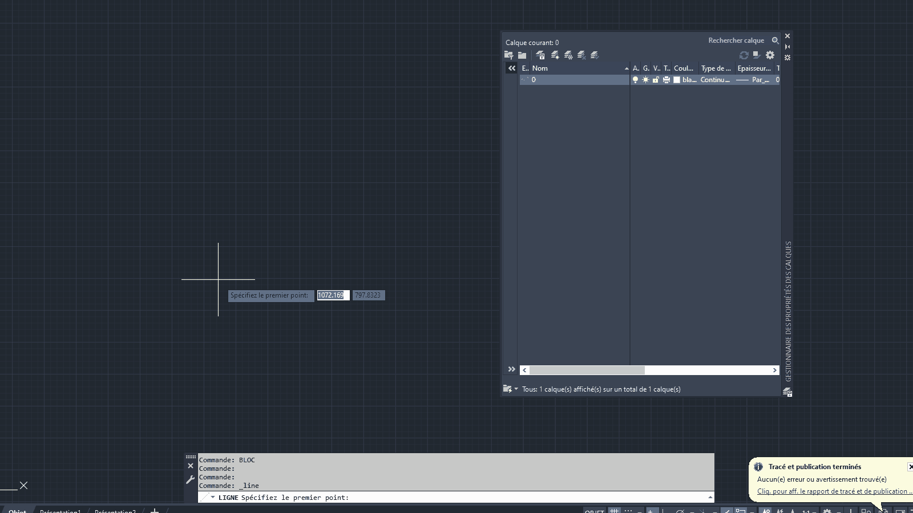
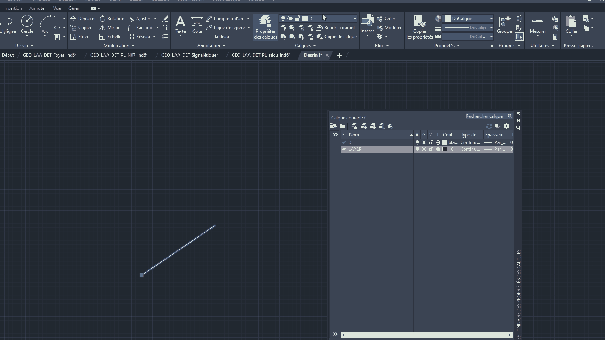

# Blocks

Ah, blocks... No guide is complete without their mention. It's such an integral part of AutoCAD drawings that for this specific case, we actually need to break down what they are, and what they are not. 

So what are blocks? For starters, let's say that **they are a set of objects that you can repeat throughout the drawing.** Blocks are a crucial part of any AutoCAD drawing that has multiple instances of the same element. And there's often many more repeating elements than meets the eye, so having a solid understanding of how they work will make a big difference.

(insert image of a drawing composed entirely in blocks)

## An important distinction

Before we dive into specifics of how to use blocks effectively, we need to make a clear distinction between a **block definition** and a **block instance**. 

In simple terms, a **block definition** is like a blueprint, and **block instances** are the individual copies of it that you insert to your drawing. When you create a new block (by invoking the `BLOCK` command), you're creating a block 
_definition._ 

After successfully creating a block, you can then insert _instances_ of said block. When you modify the _block definition_ in the future, all instances of said block that you've previously inserted into your drawing will reflect those changes accordingly.

(insert gif creating a block, copying it to create instances, and modifying the block)

Why am I getting so worked over the terminology? Because soon we'll find out that the _instances_ themselves can, in certain ways, be different than other instances of the same block. As you may have guessed, the most famous example of this is the special layer named "0", but more on that later.

<!-- Why is this important? Once we start looking into specifics (such as the `BYBLOCK` style), we need to be able to distinguish the contents of the block _definition_ and the resulting block _instance_. 

For example, if you draw a line inside your block _definition_ with the color set to `BYBLOCK`, and insert a block _instance_ whose color is `BLUE`, the line that you drew will be displayed `BLUE`. -->

## Choosing your base point

While it may be irrelevant for certain kinds of blocks, it is generally a good idea to put some thought into where to place the insertion point. It's one of the two things to pay attention to while defining your block (along with _naming it properly)._ 

If you're converting the entire floor plan into a block so that you can repeat it as a base for different sheets in your set, then placing it anywhere should be fine (unless there's an obvious reason to choose a specific point).

## Managing layers and style

### Layer "0"

First and foremost, a friendly reminder: _you should generally stay off the default layers created by AutoCAD._ (Rule of thumb to avoid unexpected behavior)

One such layer is the layer "0".

<figure markdown="span">
  
  <figcaption>Defining a block.</figcaption>
</figure>

<figure markdown="span">
  
  <figcaption>Using the layer 0.</figcaption>
</figure>

### BYLAYER and BYBLOCK

While "BYLAYER" is the way to go with your usual drawings, if you want the objects inside your block definition to match the style of your block instance

## Attributes

attdef, attsync

## Dynamic blocks

## Shortcomings

Blocks are great for a lot of things, but like everything else, they should be used in moderation.

### Nesting 

Try to avoid nesting too many blocks.

### Dynamic blocks & EDITREF

The REFEDIT command does not work for dynamic blocks, so avoid using dynamic blocks when a normal block will suffice.

## WBlock & DDInsert