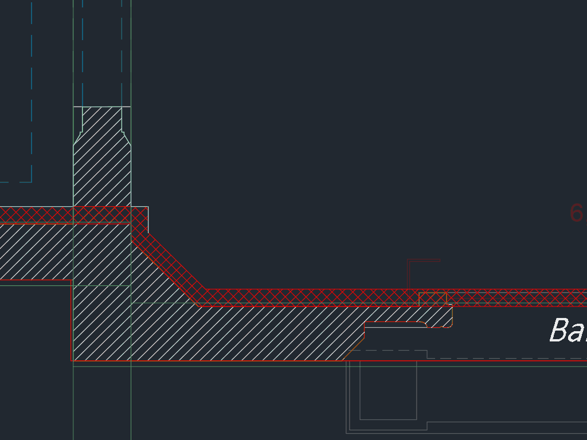

# Snapping to objects

## Shift to obtain the snap

## Avoid perpendicular snap

## Snap to endpoint by clicking the object

Doesn't work if you have "near" enabled, so don't enable it. It's not that useful anyway.

## Type the snap

`CEN`, `PERP`...

## Shift + right click

### Middle between two points